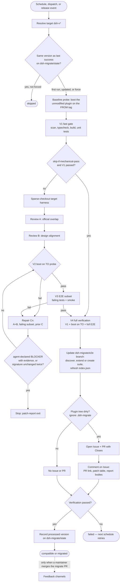
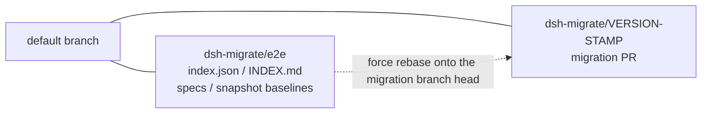
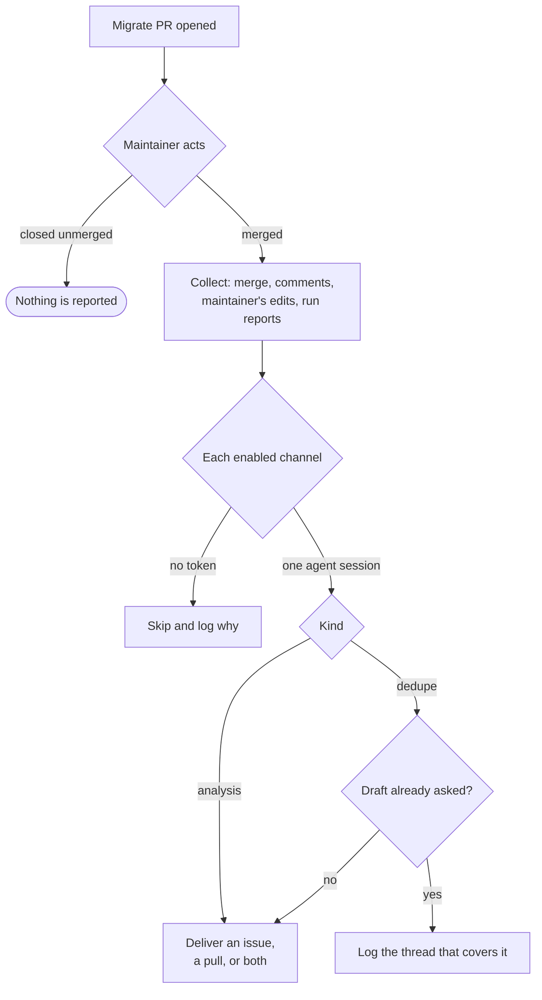

# dsh-migrate-bot

GitHub Action that watches [DeepSeek Harness](https://github.com/deepseek-ai/deepseek-harness) (`dsh-v*`) releases and migrates a third-party plugin: mechanical tests, two dsh review sessions (DeepSeek V4 Flash, thinking `max`, the shipped `standard` agent preset), a repair loop, then an Issue and PR only if the plugin tree is dirty.

Install it by adding a workflow to the plugin repository. It runs on that repo’s GitHub-hosted runners. Provide `DEEPSEEK_API_KEY_DSH_MIGRATE_BOT` as a repository secret (or another name via `api_key_env` / `secrets.apiKeyEnv`).

Pin the Action as `royenheart/dsh-migrate-bot@v0`.

## Usage

1. Add repository secret `DEEPSEEK_API_KEY_DSH_MIGRATE_BOT`.
2. Copy [examples/workflow.yml](examples/workflow.yml) to `.github/workflows/dsh-migrate.yml` and set the cron.
3. Optionally copy [examples/dsh-migrate.yml](examples/dsh-migrate.yml) to `.github/dsh-migrate.yml`.

Required permissions: `contents: write`, `issues: write`, `pull-requests: write`, and **Allow GitHub Actions to create and approve pull requests** (Settings → Actions → General → Workflow permissions); without that checkbox `GITHUB_TOKEN` can push the branch and open the Issue, then gets 403 on `POST /pulls`.

The first run always proceeds. Later scheduled runs skip when `dsh-v*` has not changed (`status: skipped`). Re-run the same version with `force: true` on `workflow_dispatch`.

Every configuration key, its default, and the optional feedback channels are in [docs/installation.md](docs/installation.md).

Last processed version is stored on branch `dsh-migrate/state` (`seen.json` + `badge.json`). Leave that branch unmerged. `seen.json` is the watch cursor (skip the next cron when dsh has not changed). `badge.json` is a [shields.io endpoint](https://shields.io/badges/endpoint-badge) for **default-branch** support: a clean `compatible` run verifies immediately; a migrate PR stays `pending` until you merge it (or `unverified` if you close it). Reports under `.dsh-migrate/` (A/B/C, harness checkout, per-patch reports) are uploaded as an artifact and are not committed.

Public README badge (replace `OWNER` / `REPO`):

```markdown
[](https://github.com/OWNER/REPO/tree/dsh-migrate/state)
```

Copy [examples/workflow.yml](examples/workflow.yml) so `pull_request: closed` refreshes the badge when you merge or reject the migrate PR. Until the first Action run writes `badge.json`, shields.io may show `invalid`.

## Pipeline



1. Resolve the target `dsh-v*` (`latest` or a pin). `latest` reads GitHub releases with `GITHUB_TOKEN`; if that call is refused (rate limit, outage, no network route) it falls back to `git ls-remote --tags` and picks the newest `dsh-v*` by version order, so an unauthenticated 60/hour bucket cannot fail the run.
2. Skip if that version matches `dsh-migrate/state`, unless `force` is set or `watch.enabled` is `false`. Failed runs do not update the branch, so the next schedule retries.
3. **Baseline probe** (`verify.boot`): boot the *unmodified* plugin tree under the previous `dsh-v*` the Action last processed. It does not decide whether to run — it decides **attribution** (`pre-existing` vs `we broke it`) and **scope** (a passing baseline confines the problem to the `from → to` hop; a failing one means the plugin is several corridors behind and the agent must trace back further). With no recorded baseline the declared `@deepseek-ai/dsh-*` peer version is used; with neither, the baseline is skipped and reported as absent.
4. **V1 fast gate**: static scan (plugin shape, keyed slots), then the plugin's own `build` / `typecheck` / unit tests — or `tests.commands`, which **replaces** the default suite. Missing `node_modules` get `npm install`, then every `@deepseek-ai/dsh-*` dependency is pinned to the target version so typecheck and tests see that harness. `DSH_MIGRATE_TARGET_VERSION` is set on those commands.
5. Sparse-checkout the target harness tag into `.dsh-migrate/harness` (not committed). Review: `always` (default) runs overlap (A) then alignment (B); `skip-if-mechanical-pass` skips A/B when the fast gate passed.
6. During A/B/C the agent preserves the plugin's documented product form (README features, named entry points, `patches/` for a complete surface). It may shrink or retire a surface only when official overlap absorbed that specific surface (same slot, menu, RPC, or behavior). A fallback or silent degrade is not coverage, and a coarser official seam is not the same job. dsh-side patches stay when official extension points still cannot cover that surface. For each remaining patch it writes `.dsh-migrate/patch-reports/<slug>/report.md`: search official [issues / PRs / discussions](https://github.com/deepseek-ai/deepseek-harness) first and record links; if none exist, write a discussion draft (`# [Feature request] …`, English summary, Background, Current state, Proposal, Appendix: patch, Questions to confirm, Related).
7. **V2 boot probe** (`verify.boot`): install the migrated tree into a scratch profile and actually start dsh under the target tag. The probe is keyless — it points the model route at a dead port and treats "reached the credential check" as a successful boot. It fails on `plugin(s) failed to load`, a throwing `apply`, `pending (waiting for services: …)`, or a watchdog timeout (dsh has no hang protection of its own).
8. On a failing probe, a repair session gets A+B, the failing subset of the output only, and prior `C1..Cn-1`; then the probe re-runs. The loop keeps the full `loop.maxAttempts` budget regardless of the baseline. It stops early only on evidence: the agent declares `BLOCKER: upstream` **with** its attempted plugin-side fixes, the offending harness source location, and why no plugin-side change can work; or two consecutive rounds produce an unchanged failure signature. Either way the outcome routes into the existing patch-report exit.
9. **V3 E2E subset / V4 full E2E** (`e2e`): the agent-authored suite runs the previously failing tests plus a smoke set during the loop, and everything once at final verification. See [docs/design/e2e-migration-pipeline.md](docs/design/e2e-migration-pipeline.md).
10. Clean plugin tree: no Issue, no PR (`.dsh-migrate/` and `.secrets.local.json` do not count as dirty and are never committed). A clean run still verifies the version, so the badge can say `compatible` without a pull request.
11. Dirty plugin tree: open an Issue and a PR. The PR body includes `Closes #<issue>`. The Action then comments on the Issue: companion PR URL, a patch-report index table, then each report body (`issuePr.language`: `en` or `zh`). For each draft (no official thread yet) it posts a follow-up comment with an [Ideas](https://github.com/deepseek-ai/deepseek-harness/discussions/categories/ideas) “open official discussion” link. Full A/B/C reports stay in the artifact. Auto-creating that official topic is not implemented; see [docs/official-discussion-auto-post.md](docs/official-discussion-auto-post.md).

### E2E suite branch

The agent-authored end-to-end suite lives on its own branch (`e2e.branch`, default `dsh-migrate/e2e`) and never appears in a migration PR:



- **First run**: the agent inspects the repository for an existing framework (`playwright.config.*`, `cypress.config.*`, `vitest.config.*`, a `test:e2e` script, an existing `e2e/` directory, CI browser installs). If one exists it extends *that*; otherwise it creates the suite under `e2e.dir` with Playwright + Chromium, matching what dsh itself uses.
- **Every run after that** re-uses and extends the same suite, so coverage accumulates instead of being rebuilt. If you merge the branch yourself, the next run's discovery step simply finds the framework already there and keeps extending it — the two are idempotent.
- **`e2e.gate`** defaults to `advisory`: on the first run the suite is authored *after* the migration, so it is a weak signal. Once a suite exists with a green baseline, set `blocking`.
- Baseline snapshots live on this branch; refresh them there, not inside a migration PR.

The whole design — layer definitions, baseline attribution table, budget policy, BLOCKER evidence rules, UI assertion strategy, and the test matrix — is in [docs/design/e2e-migration-pipeline.md](docs/design/e2e-migration-pipeline.md).

A run that only wrote `.dsh-migrate/` is treated as clean. Insufficient official balance, or this-run spend over `quota.limit` / `quota_limit`, aborts without opening an Issue or PR.

12. If the maintainer later **merges** the migrate pull request, the [Feedback](#feedback) stage reports what happened to the channels you enabled. A pull request that is closed unmerged reports nothing.

## Configuration

The full table of keys, their defaults, the Action inputs, and the quota behaviour is in [docs/installation.md](docs/installation.md#configuration). The short version:

| Field | Default |
|---|---|
| model | `deepseek-v4-flash` |
| thinking | enabled / `max` |
| mode | `standard` (dsh agent preset id: `standard`, `minimal`, `cordis`, or `ptc`) |
| review | `always` |
| watch | enabled |
| boot probe | enabled, 180s watchdog |
| watchdogs | agent session 60m, each mechanical command 20m, harness checkout 10m |
| web smoke | enabled (only when the plugin has a `dsh.client` surface) |
| E2E suite | enabled, branch `dsh-migrate/e2e`, gate `advisory` |
| Issue/PR language | `en` |
| repair loops | 5 (full budget; early stop is evidence-driven) |
| feedback channels | all three off |
| API key secret | `DEEPSEEK_API_KEY_DSH_MIGRATE_BOT` |
| quota limit | unset (this-run official USD cap) |

Override prompts under `prompts.absorption`, `prompts.alignment`, and `prompts.fix` in `.github/dsh-migrate.yml`.

## Feedback

A migrate pull request is an opinion; merging it is the maintainer's verdict. When a migrate pull request is **merged**, the Action reports the migration — the merge, the comments around it, and the files the maintainer changed before merging — to whichever channels are enabled:



| Channel | Writes to | Method |
|---|---|---|
| `upgrade-skill` | `oh-my-dsh/dsh-plugin-upgrade-skill` | issue — a wrong card, or a corridor with no card |
| `migrate-bot` | `royenheart/dsh-migrate-bot` | issue — what the maintainer fixed by hand, and which stage should have caught it |
| `harness-discussion` | `deepseek-ai/deepseek-harness` | discussion — the feature request the migration already drafted, unless it is now a duplicate |

All three are **off by default**, each needs a token that can write to its own target (`GITHUB_TOKEN` cannot), and a channel that is enabled without its token is skipped with the reason in the log rather than failing the run. You can also define your own channel with your own prompt and destination.

Set them up with [docs/installation.md](docs/installation.md#feedback-channels); the mechanism is designed in [docs/design/migration-feedback.md](docs/design/migration-feedback.md).

## Upstream benchmark

One directory below `vendor/` holds the community migration exam suite ([`oh-my-dsh/dsh-plugin-upgrade-skill`](https://github.com/oh-my-dsh/dsh-plugin-upgrade-skill)) as a submodule pinned to one commit — never to `main`, because their own comparability rules require a frozen snapshot. Their tasks ship reference answers, and an oracle run must score exactly `1.0`; that self-check runs here without Harbor or an API key:

```sh
git submodule update --init vendor/dsh-plugin-upgrade-skill
npm run check:upstream                      # oracle self-check, no API key needed
DEEPSEEK_API_KEY=... ./tools/harbor/run-benchmark.sh M1-host-migration
```

The second form scores **this project's own agent** on their exam tasks: `tools/harbor/dsh_agent.py` is a Harbor agent adapter that uploads the shipped migrate profile into the task container and runs the task statement verbatim.

<!-- benchmark:start -->
<!-- Generated by scripts/sync-readme-benchmark.ts from reports/upstream/. Do not edit by hand. -->

### `native` migration

| Scored | Attempts | Mean reward | Full score | Cache-miss in | Cache-hit in | Out | Cost |
|---|---|---|---|---|---|---|---|
| 54/56 | 168 (3/task) | **0.641** | 25 | 17.4M | 1752.3M | 13.7M | $16.11 |

Upstream `ecab245`, dsh `0.1.1-rc.2, 0.1.2-alpha.2`, 3 attempt(s) per task. Served by `deepseek-flash`, fingerprint `aeb56401ca74e127821c4f9126dcb669`.

Per-task rewards, ranges and token counts: [`20260912T201310+0000-native.json`](reports/upstream/20260912T201310+0000-native.json).

### `upgrade-skills` migration

| Scored | Attempts | Mean reward | Full score | Cache-miss in | Cache-hit in | Out | Cost |
|---|---|---|---|---|---|---|---|
| 54/56 | 168 (3/task) | **0.684** | 29 | 23.6M | 2017.2M | 14.6M | $18.37 |

Upstream `ecab245`, dsh `0.1.2-alpha.2, 0.1.1-rc.2`, 3 attempt(s) per task, with 9 community skills at `ecab245`. Served by `deepseek-flash`, fingerprint `aeb56401ca74e127821c4f9126dcb669`.

Per-task rewards, ranges and token counts: [`20260912T201310+0000-upgrade-skills.json`](reports/upstream/20260912T201310+0000-upgrade-skills.json).

Oracle self-check (reference solution, no API key): `upstream` 1.000, `dsh-home` 0.400.

Cite the section for the mode you mean: the two modes are different subjects and their means are not comparable.
<!-- benchmark:end -->

The oracle check also runs a second arm that differs by exactly one line — this Action's `DSH_HOME` — because their judge hardcodes `/root/.dsh/profiles`. That arm is the regression the check exists to catch: the same task environment scores `1.0` without it and `0.4` with it.

Records of what each run produced live in [reports/](reports/README.md), in a versioned format that pins the migration mode, the model build that served the run, every attempt, the tokens, and the price table behind the cost — the rules are in [reports/README.md](reports/README.md#rules-that-make-the-record-reproducible), and [docs/design/continuous-quality-tracking.md](docs/design/continuous-quality-tracking.md) designs a trend-and-regression framework around them. The table above is generated from those records by `npm run sync:readme`; `npm run gates` fails when it is stale.

See [docs/upstream-benchmark.md](docs/upstream-benchmark.md) for the preparations each run applies, what the suite does **not** require (isolation is only "a one-shot container"), and the defects the exercise exposed in our own code.

## Local CLI

```sh
npm install
npm test
node dist/src/cli.js run --workdir /path/to/plugin --mechanical-only --dsh-version 0.1.1-rc.2
```

`--skip-github` runs the agent without opening an Issue or PR. `--mechanical-only` skips the agent and GitHub. Host agent runs need a real `dsh` binary on `PATH` (`DSH_BIN` if it is not named `dsh`). A shell alias is not visible to `spawn`.

Put the API key in gitignored `.secrets.local.json` (see [.secrets.local.json.example](.secrets.local.json.example)), or set `DEEPSEEK_API_KEY_DSH_MIGRATE_BOT` (`DEEPSEEK_API_KEY` is also accepted locally). Live e2e: `DSH_MIGRATE_LIVE=1 npm run test:e2e`.

```sh
docker build -t dsh-migrate-bot .
docker run --rm \
  -e DEEPSEEK_API_KEY_DSH_MIGRATE_BOT \
  -v "$PWD/fixtures/plugins/typecheck-ok:/github/workspace" \
  dsh-migrate-bot run --workdir /github/workspace --mechanical-only --dsh-version 0.1.1-rc.2
```

Pass the key with `-e DEEPSEEK_API_KEY_DSH_MIGRATE_BOT` or a `KEY=value` env file, not `.secrets.local.json` as Docker `--env-file`.

The image installs the dsh CLI globally during the build. On a slow route to the public npm registry that one layer can take tens of minutes; build against a mirror instead (CI runners do not need this):

```sh
docker build --build-arg NPM_REGISTRY=https://registry.npmmirror.com -t dsh-migrate-bot .
```

## Contributing

[AGENTS.md](AGENTS.md) carries the standing orders: the commands to run, the documentation gates, and the commit conventions. [docs/index.md](docs/index.md) indexes every document and names the section that owns each subject. Run `npm run gates` before pushing.

## Releasing

Version lives in [`.cz.toml`](.cz.toml). [Commitizen](https://commitizen-tools.github.io/commitizen/) (`cz bump`) updates `VERSION`, `package.json`, `package-lock.json`, and `CHANGELOG.md`.

```sh
pipx install commitizen
npm run commit
npm run bump
git push origin HEAD
git push origin "v$(cat VERSION)"
```

The tag needs its own push: `cz` creates lightweight tags, and `git push --follow-tags` only pushes annotated ones. Pushing a `vX.Y.Z` tag runs [.github/workflows/release.yml](.github/workflows/release.yml): it opens a GitHub Release and force-updates the floating major tag (`v0.1.1` → `v0`, `v1.0.0` → `v1`). Prerelease tags like `v1.0.0-rc.1` are ignored. To retarget a major tag (rollback), run the **release** workflow manually.

Consumers pin `@v0` or `@v1`. Marketplace listing is still a checkbox on the GitHub Release.
