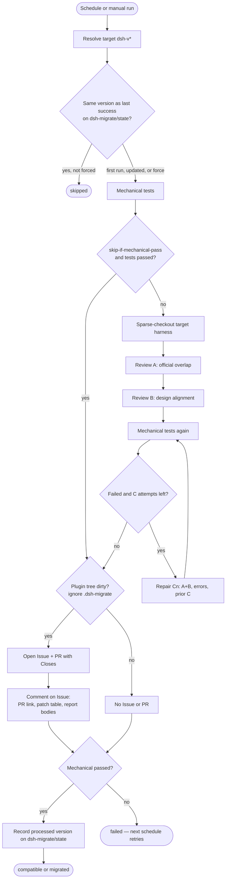

# dsh-migrate-bot

GitHub Action that watches [DeepSeek Harness](https://github.com/deepseek-ai/deepseek-harness) (`dsh-v*`) releases and migrates a third-party plugin: mechanical tests, two dsh review sessions (DeepSeek V4 Pro, thinking `max`, [dsh-anchored-standard](https://github.com/xiaobright/dsh-anchored-standard)), a repair loop, then an Issue and PR only if the plugin tree is dirty.

Install it by adding a workflow to the plugin repository. It runs on that repo’s GitHub-hosted runners. Provide `DEEPSEEK_API_KEY_DSH_MIGRATE_BOT` as a repository secret (or another name via `api_key_env` / `secrets.apiKeyEnv`).

Pin the Action as `royenheart/dsh-migrate-bot@v0`.

## Usage

1. Add repository secret `DEEPSEEK_API_KEY_DSH_MIGRATE_BOT`.
2. Copy [examples/workflow.yml](examples/workflow.yml) to `.github/workflows/dsh-migrate.yml` and set the cron.
3. Optionally copy [examples/dsh-migrate.yml](examples/dsh-migrate.yml) to `.github/dsh-migrate.yml`.

Required permissions: `contents: write`, `issues: write`, `pull-requests: write`. Also enable **Allow GitHub Actions to create and approve pull requests** (Settings → Actions → General → Workflow permissions). Without that checkbox, `GITHUB_TOKEN` can push the branch and open the Issue, then gets 403 on `POST /pulls`.

Schedule, `workflow_dispatch`, and `repository_dispatch` belong in **that** workflow file. GitHub only runs `on.schedule` from a workflow in the plugin repo; the Action itself cannot register a timer.

The first run always proceeds. Later scheduled runs skip when `dsh-v*` has not changed (`status: skipped`). Re-run the same version with `force: true` on `workflow_dispatch`.

Last processed version is stored on branch `dsh-migrate/state` (`seen.json` + `badge.json`). Leave that branch unmerged. `seen.json` is the watch cursor (skip the next cron when dsh has not changed). `badge.json` is a [shields.io endpoint](https://shields.io/badges/endpoint-badge) for **default-branch** support: a clean `compatible` run verifies immediately; a migrate PR stays `pending` until you merge it (or `unverified` if you close it). Reports under `.dsh-migrate/` (A/B/C, harness checkout, per-patch reports) are uploaded as an artifact and are not committed.

Public README badge (replace `OWNER` / `REPO`):

```markdown
[](https://github.com/OWNER/REPO/tree/dsh-migrate/state)
```

Copy [examples/workflow.yml](examples/workflow.yml) so `pull_request: closed` refreshes the badge when you merge or reject the migrate PR. Until the first Action run writes `badge.json`, shields.io may show `invalid`.

## Pipeline



1. Resolve the target `dsh-v*` (`latest` or a pin).
2. Skip if that version matches `dsh-migrate/state`, unless `force` is set or `watch.enabled` is `false`. Failed runs do not update the branch, so the next schedule retries.
3. Mechanical tests (built-in, or `tests.commands` — that list **replaces** the default suite). Before either suite, missing `node_modules` get `npm install`, then every `@deepseek-ai/dsh-*` dependency is pinned to the target version (`npm install --no-save …@<version>`) so typecheck and tests see that harness, not an older caret resolve. `DSH_MIGRATE_TARGET_VERSION` is set on those commands.
4. Sparse-checkout the target harness tag into `.dsh-migrate/harness` (not committed). Review: `always` (default) runs overlap (A) then alignment (B); `skip-if-mechanical-pass` skips A/B when step 3 passed. Use `skip-if-mechanical-pass` only when the plugin's test suite itself proves host behavior, usage, and UI still work on the pinned packages.
5. During A/B/C the agent preserves the plugin's documented product form (README features, named entry points, `patches/` for a complete surface). It may shrink or retire a surface only when official overlap absorbed that specific surface (same slot, menu, RPC, or behavior). A fallback or silent degrade is not coverage, and a coarser official seam is not the same job. dsh-side patches stay when official extension points still cannot cover that surface. For each remaining patch it writes `.dsh-migrate/patch-reports/<slug>/report.md`: search official [issues / PRs / discussions](https://github.com/deepseek-ai/deepseek-harness) first and record links; if none exist, write a discussion draft (`# [Feature request] …`, English summary, Background, Current state, Proposal, Appendix: patch, Questions to confirm, Related).
6. Re-run mechanical tests after A+B.
7. On failure, a new dsh session gets A+B, error lines only, and prior `C1..Cn-1`; write `Cn`; retest; up to `loop.maxAttempts`.
8. Clean plugin tree: no Issue, no PR (`.dsh-migrate/` and `.secrets.local.json` do not count as dirty and are never committed).
9. Dirty plugin tree: open an Issue and a PR. The PR body includes `Closes #<issue>`. The Action then comments on the Issue: companion PR URL, a patch-report index table, then each report body (`issuePr.language`: `en` or `zh`). Full A/B/C reports stay in the artifact.

A run that only wrote `.dsh-migrate/` is treated as clean. Insufficient official balance, or this-run spend over `quota.limit` / `quota_limit`, aborts without opening an Issue or PR.

## Configuration

| Field | Default |
|---|---|
| model | `deepseek-v4-pro` |
| thinking | enabled / `max` |
| mode | `anchored-standard` |
| review | `always` |
| watch | enabled |
| Issue/PR language | `en` |
| repair loops | 5 |
| API key secret | `DEEPSEEK_API_KEY_DSH_MIGRATE_BOT` |
| quota limit | unset (this-run official USD cap; insufficient official balance still aborts) |

Override prompts under `prompts.absorption`, `prompts.alignment`, and `prompts.fix` in `.github/dsh-migrate.yml`.

Inputs: `dsh_version`, `config`, `mechanical_only`, `skip_github`, `force`, `api_key_env`, `workdir`, `quota_limit`. To use a different secret, set `api_key_env` (or `secrets.apiKeyEnv` in `.github/dsh-migrate.yml`) and map that name in the workflow `env:` block.

Before each agent session the Action queries official remaining balance (`GET /user/balance` for DeepSeek). If the account is unavailable, the run stops. `quota.limit` / `quota_limit` caps this Action run's own official USD estimate (this run's cache-miss / cache-hit / output tokens × [published rates](https://api-docs.deepseek.com/quick_start/pricing), peak/off-peak from each request timestamp). Other model providers have no official balance query or rate table yet.

While dsh runs, logs print the stage and, every 10s, turns / steps / elapsed / cache hit-miss / input-output. Model text is not streamed.

The harness checkout under `.dsh-migrate/harness` is for the agent to read official source, apply or update a dsh-side patch when still required, and keep the plugin in sync. It is not committed.

## Local CLI

```sh
npm install
npm test
node dist/src/cli.js run --workdir /path/to/plugin --mechanical-only --dsh-version 0.1.1-rc.2
```

`--skip-github` runs the agent without opening an Issue or PR. `--mechanical-only` skips the agent and GitHub. Host agent runs need a real `dsh` binary on `PATH` (`DSH_BIN` if it is not named `dsh`). A shell alias is not visible to `spawn`.

Put the API key in gitignored `.secrets.local.json` (see [.secrets.local.json.example](.secrets.local.json.example)), or set `DEEPSEEK_API_KEY_DSH_MIGRATE_BOT` (`DEEPSEEK_API_KEY` is also accepted locally). Live e2e: `DSH_MIGRATE_LIVE=1 npm run test:e2e`.

```sh
docker build -t dsh-migrate-bot .
docker run --rm \
  -e DEEPSEEK_API_KEY_DSH_MIGRATE_BOT \
  -v "$PWD/fixtures/plugins/typecheck-ok:/github/workspace" \
  dsh-migrate-bot run --workdir /github/workspace --mechanical-only --dsh-version 0.1.1-rc.2
```

Pass the key with `-e DEEPSEEK_API_KEY_DSH_MIGRATE_BOT` or a `KEY=value` env file, not `.secrets.local.json` as Docker `--env-file`.

## Releasing

Version lives in [`.cz.toml`](.cz.toml). [Commitizen](https://commitizen-tools.github.io/commitizen/) (`cz bump`) updates `VERSION`, `package.json`, `package-lock.json`, and `CHANGELOG.md`.

```sh
pipx install commitizen
npm run commit
npm run bump
git push origin HEAD --follow-tags
```

Pushing a `vX.Y.Z` tag runs [.github/workflows/release.yml](.github/workflows/release.yml): it opens a GitHub Release and force-updates the floating major tag (`v0.1.1` → `v0`, `v1.0.0` → `v1`). Prerelease tags like `v1.0.0-rc.1` are ignored. To retarget a major tag (rollback), run the **release** workflow manually.

Consumers pin `@v0` or `@v1`. Marketplace listing is still a checkbox on the GitHub Release.
