# Layered verification and the E2E migration pipeline

How this Action verifies a plugin migration: a tiered gate stack, baseline attribution, an agent-authored end-to-end suite, and the budget rules that decide when to keep repairing and when to stop.

> Status: implemented (`src/verify/`, `src/e2e/`, `src/pipeline/orchestrator.ts`).
> This document is maintained alongside the code.

## 1. The problem

The original pipeline verified in one layer: a static scan, then `npm install`, then the plugin's own `build` / `typecheck` / `npm test`. Three structural gaps:

| Gap | Consequence |
|---|---|
| **The plugin was never loaded into dsh** | Nothing proved the host could load it, activate it, or survive it. "Typecheck passes, product does not start" is the most common migration failure |
| **No baseline** | "We broke it" and "it was already broken" are indistinguishable, so the report could not say which |
| **No runtime behaviour** | A UI plugin's interactions, timing, layout overflow and console errors are invisible to unit tests and type checks |

## 2. Principles

1. **Let the agent explore; do not write narrow matching rules.**
   Runtime failures present themselves in open-ended ways (service collisions,
   duplicate slot registrations, vanished patch targets, renamed services). A
   regex taxonomy will be wrong often, and **a wrong prior is worse than none**:
   it lands in every later round's context as though it were a fact. So there is
   deliberately **no failure-classification stage**.

2. **Decide from evidence, never from a guess about the cause.**
   Whether to keep spending, and when to stop, follows from what was observed:
   has the failure signature changed, has the agent declared a blocker *with*
   evidence, has the spend cap been reached.

3. **Cheap layers first, expensive layers last, short-circuiting each round.**
   Running a browser suite on a tree that fails typecheck is pure waste, and E2E
   output is long and expensive to feed back; the model should get the smallest
   failing set.

4. **The repair loop may not edit tests.**
   The E2E suite lives on its own branch. Otherwise the agent learns to make
   tests pass, and the suite rots from the inside.

5. **Every verification result is visible, attributable and reproducible.**

## 3. The gate stack

| Layer | What it runs | Cost | Needs an API key | What it catches |
|---|---|---|---|---|
| **V1 fast gate** | Static scan, `typecheck`, `build`, the plugin's own unit tests (`tests.commands` or the default suite) | seconds | no | type, build and unit-level breakage |
| **V2 boot probe** | Installs the tree into a scratch profile and really starts dsh; verdict from exit code and stderr | tens of seconds | **no** | plugin fails to load, `apply` throws, permanent PENDING, hung boot |
| **V2b web smoke** | `dsh web --port 0 --no-open` with the plugin mounted; waits for the ready line | tens of seconds | **no** | "the UI plugin never attached", web composition failures |
| **V3 E2E subset** | The previously failing tests plus a smoke set | minutes | no | the minimal runtime regression |
| **V4 full E2E** | The whole suite | minutes | no | convergence; catches "fixed A, broke B" |

### Why V2 works: dsh already fails loud

dsh's boot path ends in `assertEntriesActivated(ctx, binName)` and therefore detects, in one call:

- **import failure** → `dsh: plugin(s) failed to load: <name>`
- **`apply` throwing** → `<name>: <error>`
- **permanent PENDING** (an injected service nobody provides) →
  `<name>: pending (waiting for services: <svc>)`

and exits non-zero. Separately, `dsh --profile <p> --patch <overlay>
--dump-config` verifies a layer without booting and reports unmatched patch
targets on stderr, which catches "a row was renamed upstream and the plugin's layer silently stopped applying".

**dsh has no hang watchdog**, so the probe carries its own.

### The probe is keyless

The probe never calls a model: it uses a placeholder key and points the model route at a dead port. **Reaching the credential or transport error is the success signal** — it proves the plugin tree assembled and activated. Verdicts come from dsh's own output vocabulary; the probe does not invent a parser for it.

## 4. Baseline attribution

A run knows two versions: `from` (the tag recorded in `seen.json`) and `to` (this run's target). The probe runs against both.

### Choosing `from`

1. the `tag` in `seen.json` on the `dsh-migrate/state` branch
2. otherwise the harness version the plugin declares in its own
   `@deepseek-ai/dsh-*` ranges, as a pseudo-baseline
3. otherwise the baseline is skipped and the report says so

### Three uses — none of which is "decide whether to run"

| Use | Meaning |
|---|---|
| **Attribution** | the report can state plainly that the plugin was already broken before this run touched it |
| **Repair scope** | baseline **passes** → the problem is confined to the `from → to` hop, so the agent only needs the target tag. Baseline **fails** → the plugin is behind by more than one corridor, so the target tag alone cannot explain it and the agent must look further back |
| **Truth** | prevents a "nothing changed, so call it compatible" verdict |

### Run status depends only on `to`

| from | to | status | budget | action |
|---|---|---|---|---|
| pass | pass | `compatible` | — | normal |
| pass | fail | **`failed`** | full | a regression from this corridor; focus on `from → to` |
| fail | pass | `migrated` | full | also repaired a pre-existing break; say so |
| fail | fail | **`failed`** | **full** | mark pre-existing and **widen the search**; whether to stop is the agent's call |
| no baseline | fail | **`failed`** | full | say the baseline is absent and continue |

> **A failing baseline never stops the run.** A plugin several releases behind is
> the common case and exactly what this Action exists to fix; stopping there
> would refuse the job when it is most needed. Identical signatures do not mean
> "unrelated to this corridor" either — a plugin five versions behind produces
> the same failure on `from` and `to`.

## 5. Budget policy

| Mechanism | Rule |
|---|---|
| **Full budget by default** | `loop.maxAttempts` is granted regardless of the baseline |
| **Convergence stop** | two consecutive rounds with an unchanged failure signature, where the repair session reports it could not change it → stop |
| **Self-declared blocker** | the repair session may answer `BLOCKER: upstream` with a reason, the plugin-side fixes it attempted, the harness source location, and why no plugin-side change can work → stop and route into the existing patch-report exit |
| **Spend cap** | the existing `quota.limit`, independent of any failure cause |

**A blocker needs evidence.** Missing `ATTEMPTED`, `HARNESS` or `WHY-NOT-PLUGIN`
makes the declaration invalid, so an agent that hits a hard problem cannot shortcut the budget by blaming the host.

## 6. The E2E suite branch

```
main ──┬────────────────────────────────────────────►
       │
       └── dsh-migrate/e2e          ← index, specs, snapshot baselines
       dsh-migrate/<version>-<stamp> ──► PR   ← never carries suite files
```

**One migrate pull request at a time.** The name carries the moment a run started, so two runs are two branches and two pull requests: the second is built from the same unmigrated base and reviews the same migration twice, and the recorded pending row — one row, by design — would be the second's, so merging the first would promote a tag nothing verified. A run that would publish therefore stops while one is open, and `allow_second_pull_request` is the override that accepts a second — not `force`, which means "run though dsh has not changed" and has nothing to do with how many pull requests are open.

| Decision | Value | Why |
|---|---|---|
| Branch name | `e2e.branch`, default `dsh-migrate/e2e` | configurable |
| Relationship to the migration PR | **independent**; never in the PR diff | the PR proposes a change; the suite is a durable asset. Mixed together the PR could never be reviewed, and every migration would conflict |
| Base | `e2e.baseRef` follows the migration branch head, `e2e.forceRebase: true` | so the tests describe the migrated state |
| When that head disappears | falls back to the remote default branch, then to `HEAD` | a closed or deleted migration branch must not strand the suite |
| After the user merges it | the next run's discovery step finds the framework already present and extends it | idempotent |
| Discovery | `playwright.config.*`, `cypress.config.*`, `vitest.config.*`, a `test:e2e` script, an existing `e2e/` or `tests/e2e/`, CI browser installs | extend theirs rather than introducing a second stack; otherwise create under `e2e.dir` |

### The index

Both machine-readable and human-readable, written by the agent:

```jsonc
// e2e/index.json
{
  "schema": 1,
  "generatedFor": { "dsh": "0.1.5-rc.1", "plugin": "0.2.3" },
  "framework": "playwright",
  "files": ["e2e/playwright.config.ts", "e2e/specs/settings.spec.ts"],
  "features": [
    {
      "id": "settings-panel",
      "surface": "web-client",
      "entry": "open the settings panel",
      "input": "type foo into the search box",
      "expect": "the list filters and no scrollbar appears",
      "checks": ["aria", "geometry:overflow", "console"],
      "test": "e2e/specs/settings.spec.ts",
      "state": "passing",
      "lastPassedFor": "dsh-v0.1.3-alpha.2"
    }
  ]
}
```

`lastPassedFor` is the coverage ledger: which feature was verified against which harness tag. `files` records what belongs to the suite so a later run can restore it after overlaying the plugin tree — without it the plugin's own `package.json` would clobber the suite's script and devDependencies.

### Gate escalation

| Stage | Suite state | Signal | Gate |
|---|---|---|---|
| Run 1 | does not exist; authored after the migration | weak (the agent wrote the tests it then passes) | **advisory** |
| Run 2+ | exists, authored against a known-good state | strong (a real regression gate) | may become **blocking** |

The trigger is "a suite exists with a green baseline", not a run count.

## 7. UI end-to-end testing

dsh itself tests its web client with **real Chromium + Playwright** (89 E2E files under `apps/web/tests/`, 77 of which launch Chromium), including geometry assertions such as `composer-tab-geometry` and `chat-scroll-contract`. Its README states the reason plainly: *"Only a real engine can show any of this. Scrolling is layout: jsdom reports…"*.

We use the same tooling but not their harness: their `scaffold.ts` is deliberately not a package, and its assertions depend on dsh-internal `data-*` conventions that drift between releases.

### Four layers of assertion

| Layer | Approach | Needs a baseline |
|---|---|---|
| **Structure (primary)** | ARIA roles and accessible names, text content, **geometry invariants**, console/pageerror tripwires | no |
| **Timing** | drive to a state (streaming, aborted, retrying, long history) and assert; **stability polling** (two consecutive identical normalized reads) | no |
| **Visual** | Playwright `toHaveScreenshot()`, baselines on the suite branch | yes |
| **Model vision** | a screenshot handed to a vision model as a *third opinion* | yes, and **never a gate** |

**Geometry invariants** are how "text overflows its box in an edge state" gets
caught without a baseline or a model. For every visible element: content clipped by its box (`scrollWidth > clientWidth`, `scrollHeight > clientHeight`), a bounding rect outside its parent's clip, occlusion at the element's own centre, and collapsed layout (zero-size or fully offscreen).

### Determinism rules (borrowed from dsh)

- **Never `networkidle`** — it never resolves while an SSE stream is open.
- **Never a single-shot transient DOM assertion** — "sampling `[data-streaming]`
  is a race by construction".
- Two-layer barriers: host-side idle first, then a browser-side settled poll.
- **No retries on the browser lane**; uncertain cases go on a quarantine list and
  are reported, not hidden.
- Screenshot on failure, into the run directory.

## 8. Overall flow

```mermaid
flowchart TD
    T1["schedule"] --> RES
    T2["workflow_dispatch<br/>manual / forced rerun"] --> RES
    T3["repository_dispatch<br/>dsh-release"] --> RES
    T4["pull_request closed<br/>migration PR merged or closed"] --> RB["refresh-badge<br/>rebuild badge / verified state"]
    RB --> E0([end])

    RES["resolve target dsh-v*<br/>GITHUB_TOKEN, git ls-remote fallback"] --> GATE
    GATE{"same as seen.json<br/>and not forced?"}
    GATE -- "yes" --> SKIP["status = skipped"] --> E1([end])
    GATE -- "no / first run / forced" --> P0["P0 bootstrap<br/>npm install + pin dsh peers to the target"]

    P0 --> B1["P1 baseline probe on FROM<br/>boot the unmodified tree"]
    B1 --> BQ{"boots?"}
    BQ -- "yes" --> BR1["context: the problem is confined to FROM to TO"]
    BQ -- "no" --> BR2["context: the plugin is several corridors behind<br/>look further back (not a stop signal)"]

    BR1 --> V1
    BR2 --> V1
    V1["V1 fast gate<br/>scan, typecheck, build, unit tests"]
    V1 --> SKIPQ{"skip-if-mechanical-pass<br/>and V1 passed?"}
    SKIPQ -- "yes" --> FINAL
    SKIPQ -- "no" --> P3["P3 sparse-checkout the target harness"]
    P3 --> P4["P4 review A: official overlap<br/>review B: design alignment"]

    P4 --> LOOP
    subgraph LOOP["P5 repair loop (<= loop.maxAttempts, evidence-driven stop)"]
        direction TB
        L1["V2 boot probe on TO"] --> LQ1{"passes?"}
        LQ1 -- "no" --> FIX
        LQ1 -- "yes" --> L2["V3 E2E subset<br/>previously failing tests + smoke"]
        L2 --> LQ2{"passes?"}
        LQ2 -- "no" --> FIX["repair session<br/>A+B, failing subset, prior rounds"]
        FIX --> CONV{"blocker with evidence,<br/>or signature unchanged twice?"}
        CONV -- "yes" --> OUT["stop: patch-report exit"]
        CONV -- "no" --> RETRY{"attempts left<br/>and under quota.limit?"}
        RETRY -- "yes" --> L1
        RETRY -- "no" --> OUT
    end
    LQ2 -- "yes" --> FINAL
    OUT --> FINAL

    FINAL["P6 full verification<br/>V1 + boot on TO + web smoke + V4 full E2E"]
    FINAL --> FQ{"all pass?"}
    FQ -- "yes" --> E2EB
    FQ -- "no" --> D1
    E2EB["P7 E2E branch<br/>discover, extend or create, refresh index.json"]
    E2EB --> E2ER["force rebase onto the migration branch head<br/>push the suite branch"]
    E2ER --> D1

    D1{"plugin tree dirty?<br/>ignoring .dsh-migrate"}
    D1 -- "no" --> NOPUB["no Issue, no PR"]
    D1 -- "yes" --> PUB["open Issue + PR<br/>baseline attribution, probes, E2E summary"]
    PUB --> CMT["comment on the Issue: PR link, patch-report index, draft discussion links"]
    CMT --> REC
    NOPUB --> REC

    REC{"fast gate and final verification passed?"}
    REC -- "yes" --> SAVE["write dsh-migrate/state<br/>seen.json + badge.json"]
    REC -- "no" --> NOSAVE["do not write state; the next schedule retries"]
    SAVE --> E2([end])
    NOSAVE --> E2

    SW1["--mechanical-only<br/>V1 only"] -.-> V1
    SW2["--skip-github<br/>run the agent, publish nothing"] -.-> PUB
    SW3["e2e.enabled=false<br/>skip P7 and V3/V4"] -.-> E2EB
```



## 9. Configuration

```yaml
dsh:
  provider: deepseek-official
  model: deepseek-v4-flash
  thinking: enabled
  reasoningEffort: max
  mode: standard

verify:
  boot:
    enabled: true
    timeoutMs: 180000      # dsh has no hang protection of its own
  web:
    enabled: true
    timeoutMs: 120000

e2e:
  enabled: true
  branch: dsh-migrate/e2e
  forceRebase: true
  baseRef: migration       # or any explicit ref
  dir: e2e                 # used only when creating a suite
  gate: advisory           # advisory | blocking
  subsetFirst: true

loop:
  maxAttempts: 5           # full budget; stopping early is evidence-driven

timeouts:
  agentMs: 3600000
  commandMs: 1200000
  checkoutMs: 600000
```

## 10. Watchdogs

dsh has no hang protection, and this Action originally had none either: a stuck agent session, a hung `npm test` or a stalled harness clone would hold the job until the runner's own six-hour limit. `quota.limit` bounds spend and `loop.maxAttempts` bounds rounds; neither bounds a single hang.

| Where | Behaviour |
|---|---|
| agent session | SIGTERM, then SIGKILL after 10s; throws `AgentTimeoutError`, keeps the partial output and the last 2 KB of stderr so the report shows where it stalled |
| mechanical command | `spawnSync` timeout with `SIGKILL`; the failure reads `command timed out after Ns (watchdog): <command>` |
| harness checkout | reported separately as an incomplete checkout, not as a generic git failure |

A watchdog is not a budget: it exists so a hang fails loudly.

## 11. Agent Notes: why two layers

dsh records design decisions as Agent Notes under `.agents/notes/` in its own repository. An earlier version of the alignment prompt listed "Agent Notes" among the official design surfaces to align with, and the agent wrote one **into the plugin repository** — where the mechanical publish path would have committed it into the migration PR.

What the investigation established (all measured): dsh does not do this on its own (a neutral prompt produced only the file it was asked for); the container has no `AGENTS.md` and no `.agents/`; the `standard` preset ships no skills; the fixture declares nothing about notes. **The only place the concept appears is our own prompt.**

So two layers are used together:

1. **Prompt**: Agent Notes are evidence to read; writing design notes into a
   third-party plugin repository is forbidden. A controlled re-run confirmed it:
   before, `.agents/notes/implemented/architecture/…md` appeared in the tree;
   after, it did not, and the alignment report was still complete.
2. **Structure**: `.agents/notes/**` is excluded by `.git/info/exclude`,
   `isMigrateNoisePath` (the dirty check and the staging reset) and the
   `worktreeDiff` pathspec. **Whether the model complies no longer matters.**

Only `.agents/notes/` is excluded, not `.agents/` — a plugin may legitimately ship its own `.agents/skills/` or `.agents/config.yml`.

## 12. Acceptance and the test matrix

Every mechanism has positive and counter-example fixtures under `tests/fixtures/plugins/`:

| Mechanism | Positive | Counter-example |
|---|---|---|
| boot probe | `official-overlap-markdown` (real dsh: `pass: reached the model call`) | **`boot-break`** (`apply` throws → `fail`, signature names the plugin and the error); plus missing `dsh.bundle`, missing patch file, permanent PENDING, watchdog timeout |
| baseline attribution | from passes, to passes | from passes/to fails (regression); from fails/to fails (pre-existing) |
| signature convergence | two different signatures (continue) | identical signatures (stop) |
| blocker | declared with all three evidence fields (stop) | missing evidence (continue) |
| E2E discovery | an existing Playwright config (extend it) | no framework at all (create under `e2e.dir`) |
| E2E branch | the base ref exists (rebase onto it) | the base ref is gone (fall back to the default branch, then `HEAD`) |
| Agent Notes | read-only (prompt plus regression test) | excluded structurally by all four mechanisms |
| dsh install cache | already cached (no reinstall) / installed with a binary | npm failure / claims success but produces no binary |
| image | the Chromium layer and all four build args are present | — |

Online verification: `DSH_MIGRATE_LIVE=1 npm run test:e2e` (needs the API key in `.secrets.local.json`). The probes and the E2E layer themselves need **no key** and run offline.

### Verified live (real container, real dsh 0.1.5-rc.1)

| Case | Measured |
|---|---|
| healthy plugin (`official-overlap-markdown`) | `pass` — `pass: reached the model call` |
| plugin that breaks the boot (`boot-break`) | `fail` — `failed to apply loader entry fixture-boot-break (@fixture/dsh-plugin-boot-break): fixture-boot-break: activate() always throws` |
| web smoke | `web: server ready` from `dsh web: http://127.0.0.1:<port>/?token=…` (the session token is redacted before it reaches any report) |
| full run with a real key | `status: migrated`, `fixAttempts: 0`; the agent authored a real suite (3 specs, support helpers, a 6-feature index with `geometry:overflow` checks) |

Each of those runs exposed a defect that static work had missed: dsh reports a completed boot with `TRANSPORT:` (initially classified as a failure), a real crash is a Node stack dump rather than a named boot failure (the signature initially captured stack punctuation), `detectBaseBranch()` fell back to a branch that did not exist so the suite was never published, the overlay clobbered the suite's own `package.json`, and the web ready line carries a live session token.
