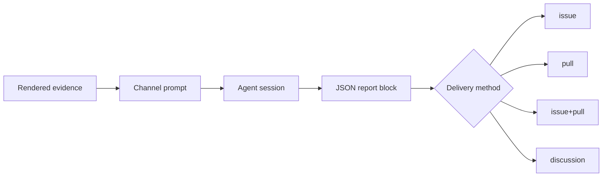

# The migration feedback stage

How a merged migrate pull request becomes a report in somebody else's repository: what triggers it, what evidence it collects, why the session is separated from the delivery, and what each of the three built-in channels is for.

## 1. Why the merge is the trigger

Opening a migrate pull request proves only that the Action had an opinion. The merge is the maintainer's verdict on that opinion, and it is the first moment the run's quality is observable from outside:

| Signal | What it means | Worth forwarding |
|---|---|---|
| Pull request opened | The Action changed something | No — most of these are noise until a human reads them |
| Pull request closed unmerged | The migration was unnecessary, or wrong | Not as a defect report; it is not yet known which |
| Pull request merged as pushed | The maintainer accepted the run as it stands | Yes, as one accepted migration |
| Pull request merged after edits | The maintainer redid part of it by hand | Yes — this is the most specific defect signal a run produces |

Only the last two are reported, and the difference between them is carried into the report rather than averaged away: the files the maintainer changed before merging are collected explicitly, because they are the part of the run a human had to redo.

## 2. What one run collects

Everything is collected by the Action and rendered into the prompt. The session never fetches, because by the time the merge happens the repository it would have to read is one it has no token for, and a session that goes looking reports a gap instead of the evidence.

| Evidence | Source | Why it is there |
|---|---|---|
| Plugin, `from → to` tags, merge commit, merger, author | The pull request, plus the state recorded before reconciliation | Names the corridor, which is the unit every downstream project works in |
| Human comments on the issue, the pull request, and the diff | GitHub | The maintainer usually says in one sentence what no report states |
| Files changed by commits the Action did not author | The pull request's commit list | The hand-fixes, per file, with line counts |
| Report A, report B, repair reports, mechanical output | `.dsh-migrate/runs/<id>/` | What the Action believed while working |
| Patch reports | `.dsh-migrate/patch-reports/<slug>/report.md` | The dsh-side changes the migration still needs, and any official thread already found |
| Candidate official threads | The links the patch reports already carry | The duplicate check the issue stage could not perform |

The state is read **before** the merge is reconciled: the pending row names the pull request and the tag the migration targeted, and reconciliation is what removes it.

## 3. One session per channel, one delivery per session

The prompt and the delivery are separate on purpose. A channel is a prompt plus a destination, so adding a destination is a config entry rather than a code path, and the same evidence feeds every channel.

Payload parsing is strict: the session must end with one fenced JSON block carrying a non-empty `title` and `body`, and file paths must be repository-relative. A session that cannot produce its block is reported as a failure on that channel and nothing is delivered. The Action never repairs a malformed payload, because a repaired payload is one nobody reviewed.

## 4. The three built-in channels

| Channel | Kind | Destination | Why this shape |
|---|---|---|---|
| `upgrade-skill` | analysis | issue in `oh-my-dsh/dsh-plugin-upgrade-skill`, label `bug` | Their bug template exists for "a wrong migration fact" and "a coverage gap"; a real migration is the only source of both. A card pull request is forbidden there as a side effect of migrating somebody else's plugin |
| `migrate-bot` | analysis | issue in `royenheart/dsh-migrate-bot` | The merge plus the maintainer's edits say which gate should have caught what they fixed by hand |
| `harness-discussion` | dedupe | discussion in `deepseek-ai/deepseek-harness`, category `Ideas` | The draft was already written during the A/B reviews; the only open question at merge time is whether the request now exists |

### Why the discussion channel classifies instead of writing

The draft spec lives in `src/prompts/discussion-draft.ts` and is consumed twice: by the A/B harness-context note, which asks the migration agent to write the draft, and by this channel, which posts the draft that already exists. A second "open a discussion" prompt would let the two describe different documents, so the channel's prompt only decides whether to post, and its output contract is a per-draft `post` / `hold` decision rather than a title and body.

That decision is the one thing the reviews could not make: between the issue stage and the merge, somebody may have opened the same request or shipped it. The Action supplies the candidate threads its patch reports already cite; when there is nothing to judge, the prompt is told the search was inconclusive rather than empty.

## 5. Failure is never the run's failure

A channel is skipped, with its reason logged, when any of these hold:

- `feedback.enabled` is false, or the channel's own `enabled` is false.
- The channel's token is not in the environment. `GITHUB_TOKEN` cannot substitute: it is scoped to the plugin repository, which is not the destination of any built-in channel.
- There is no recorded migrate pull request, or the pull request is not merged.
- No DeepSeek API key is configured, so no session can run.
- The discussion channel found no draft to classify, because every patch report already cites an official thread.

A session that runs and fails, or a delivery the API rejects, is reported as that channel's failure. None of these change the job's exit status: the channels write to repositories their enabler does not control, and a rejected report is not a reason to fail a migration that already merged.

A merge is reported **once per channel**. The stage records the merge in `seen.json` on the `dsh-migrate/state` branch as soon as a channel has delivered, naming the channels that took it, and every later attempt at that merge skips exactly those channels and says why — the merge event fires once, but a re-run fires the stage again. The record names channels rather than the merge alone because those are the two different questions a re-run asks: a channel that already received this report must never receive it twice, and a channel that was skipped or failed still owes one. This holds for `/dsh-migrate feedback` too, which is why the check lives in the stage rather than in the merge path: reporting the same merge to the same channel twice is the one failure this stage can never take back. `feedback --resend` is how a maintainer means it anyway, for a channel whose configuration or prompt has changed since it last received one.

## 6. Commands

The same command interface is reachable from two places — a comment on the pull request or issue, and the deploy target's own surface ([the preview and the live view](preview-and-live-view.md#6-commands) own what the target is) — and both callers parse the same table. One interface means one permission check, one idempotency rule, and one audit line per invocation, instead of two surfaces that drift into disagreeing about who may do what.

| Verb | Effect | Gate |
|---|---|---|
| `status` | Report the recorded state, the recorded migrate pull request, every channel with whether it is on and what it is missing, the commands already carried out, and — when a target is configured — the preview's own state, which only the target knows | none |
| `feedback` | Send the enabled channels now, for a run whose pull request did not merge | none, but it is the only way to send before a merge, and it is explicit |
| `feedback --dry-run` | Print what each enabled channel would send — the title and the first 1,200 characters of the body for a channel that opens a thread, the per-draft post or hold decision for the one that classifies — and send nothing. It runs the channel sessions, because only a session produces the text a user wants to review, so it costs what a send costs | none |
| `feedback --resend` | Send to a channel this merge was already reported to, for a channel whose configuration or prompt has changed since | none |
| `redeploy` | Rebuild the preview from the pull request's current head | none |
| `destroy` | Tear the preview down and discard its scratch tree | none |
| `extend` | Ask the deploy target to move the preview's expiry out by `deploy.preview.extendDays`, with `deploy.preview.ttlDays` as the ceiling; both travel with the request, the configuration cannot ask for more than the ceiling, and the target is what enforces it | none |
| `publish` | Freeze the preview's scratch tree, fetch that revision as a diff, apply it to the pull request head, and push only if the gates pass. The pull request has to be open, its head has to live in this repository, and the checkout has to push to the remote it fetched from — a `pushurl` or a `pushInsteadOf` that reaches anywhere else is refused, because the reply names the branch the commit landed on. The reply names the commit, the branch, and the tag the gates verified against, and the target is told how it ended | **the full gate stack, in this invocation, before anything is pushed** |

`feedback --dry-run` is the reason this interface matters beyond convenience. Feedback is otherwise automatic: a merged pull request sends whatever the channels produced, and the user has no way to see it first or stop it. A dry run makes the outbound payload reviewable, and a manual send makes the automatic path a default rather than the only path.

Rules for every verb:

- **The commenter must have write access** to the repository, established from the comment's `author_association` — never from the text of the comment. The association is the value GitHub recorded when the comment was created; an API permission lookup is the stricter check the code does not make yet. **No verb accepts free text**: a token that is not a declared flag is refused, because text from a comment reaching an agent that holds an API key is a prompt-injection surface.
- **Idempotent per command.** A delivery the Action has already carried out is answered rather than repeated. What a repeat is matched on is the delivery, never the recorded state: the comment that carried the command when there is one, otherwise the workflow run that delivered it, plus the verb. Re-running a workflow is the same command delivered again, and a comment edited into a different verb is a different command. A key that folded in the recorded pull request would change the moment a scheduled run opened the next one, and the same comment would execute twice — which is the failure this rule exists to prevent. The repository is in the key because the key is also what the deploy target sees, and a target serves several repositories; it is read from the workflow's environment rather than from the checkout, so a transient git failure cannot re-key a command. A repository *rename* changes every key, and deliveries made under the old name become new commands.
- **What is recorded, and what is not.** A command that changed something outside the run is written to `seen.json` on the `dsh-migrate/state` branch, and its next delivery answers with `already ran` and the time of the first one. `feedback` is why that half exists at all: it has no deploy target to be idempotent for it. A command is recorded only when something outside the run changed, which is why a failed one is not: re-running a failed workflow retries it instead of being suppressed, and a `feedback` whose every channel failed is retried the same way, because the stage ran and nothing left the machine. Read-only verbs are not recorded either: `status` reports whatever is true when it is asked, and `feedback --dry-run` stays re-runnable after a configuration change — a redelivered dry run does run its sessions again, and it costs what a send costs.
- **The record is bounded, and beyond the bound a redelivery is a new command.** The ledger drops anything older than 30 days and keeps the newest 200 command records and the newest 100 merge records, counted apart so that a busy month of commands cannot make a merge look unreported. A command older than those bounds is not suppressed: a webhook can be redelivered by hand at any time, and an old workflow can be re-run with its comment id and run id unchanged. Nothing warns about that, because there is nothing to warn with — the record is gone.
- **The window where this Action cannot remember.** The record is written after the command has acted, so a crash, a cancelled workflow, or a state branch that refuses the write leaves an effect that was never written down, and its redelivery runs again. The reply says so when it happens, in the words that make it actionable; a command that failed to record itself is the one case where the target's own key is the only thing standing between a redelivery and a second effect. The branch has more than one writer, so a write that loses a race is retried — three attempts, each re-reading the branch — before it is given up on, and only a rejected push is worth retrying. A writer that replaces the whole file merges the ledger rather than replacing it: two ledgers as one keep every record, a key both hold keeps the earlier time, and a merge report's channels accumulate.
- **The target's half.** Every mutating call that is a request also carries `Idempotency-Key`, so a target keeps its own record and cannot act twice even when this Action's record was lost to a concurrent write of the state branch or to that window. The `publish-result` report carries none: repeating a report is harmless, and a key would make a target treat a second one as an instruction. [The target's API](preview-and-live-view.md#8-the-targets-api) owns what that obliges it to answer.
- **The reply is the record.** Every invocation answers on the thread it came from, including a refusal and its reason, so the audit trail is the conversation. A delivery that did nothing is reported as `command_repeat: true` in the step outputs as well, because a workflow cannot read prose and "nothing happened this time" is a different outcome from "it happened": that is a delivery the ledger suppressed, one a target answered from the key it was given, or a `publish` whose revision the branch already carried. `status` lists the newest five records, with the origin of each.
- **A reply is assembled from values this Action did not write.** A verb, a time, a channel name, a tag and a reason come out of the state branch, a target, or git, and a newline in one of them forges a row, a mention, or a link in the comment it lands in. Each is collapsed to one line, with backticks dropped and its length bounded, before it is rendered. That is one rule rather than one per reply: `src/render/text.ts` holds it, and every value this Action writes into a comment, a step summary, a log line or a report field goes through it. A document a report quotes whole — a verdict, a diff, a patch report's body — is the report's content rather than one of its values, and is fenced with a fence longer than anything in it. A URL among those values is not shown unless it survives as one, and the reasoning is [access control](preview-and-live-view.md#5-access-control)'s.
- **When the state branch cannot be read.** A `seen.json` this build cannot parse is treated as no state, and the badge-only write that follows replaces the branch tree — so the ledger goes with it. That is not silent: the run logs that the file could not be read as state and how many command records the write drops.

## 7. What this stage does not do

- It does not report on its own: the automatic path waits for a merge so the signal stays a verdict rather than a volume, and `feedback` is the one explicit way to send for a pull request that is still open.
- It does not aggregate across repositories. Every channel reports one migration to one place; anything that needs a fleet-wide view is a consumer's job, and [continuous-quality-tracking.md](continuous-quality-tracking.md) is where this repository's own tracking lives.
- It does not write version cards, corridor claims, or registry entries anywhere, for the reasons in [§4](#4-the-three-built-in-channels).
- It does not run when `mechanical_only` or `refresh_only` is set; `feedback_only` is its own invocation.
