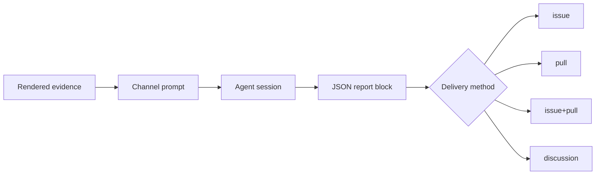

# The migration feedback stage

How a merged migrate pull request becomes a report in somebody else's repository: what triggers it, what evidence it collects, why the session is separated from the delivery, and what each of the three built-in channels is for.

## 1. Why the merge is the trigger

Opening a migrate pull request proves only that the Action had an opinion. The merge is the maintainer's verdict on that opinion, and it is the first moment the run's quality is observable from outside:

| Signal | What it means | Worth forwarding |
|---|---|---|
| Pull request opened | The Action changed something | No — most of these are noise until a human reads them |
| Pull request closed unmerged | The migration was unnecessary, or wrong | Not as a defect report; it is not yet known which |
| Pull request merged as pushed | The maintainer accepted the run as it stands | Yes, as one accepted migration |
| Pull request merged after edits | The maintainer redid part of it by hand | Yes — this is the most specific defect signal a run produces |

Only the last two are reported, and the difference between them is carried into the report rather than averaged away: the files the maintainer changed before merging are collected explicitly, because they are the part of the run a human had to redo.

## 2. What one run collects

Everything is collected by the Action and rendered into the prompt. The session never fetches, because by the time the merge happens the repository it would have to read is one it has no token for, and a session that goes looking reports a gap instead of the evidence.

| Evidence | Source | Why it is there |
|---|---|---|
| Plugin, `from → to` tags, merge commit, merger, author | The pull request, plus the state recorded before reconciliation | Names the corridor, which is the unit every downstream project works in |
| Human comments on the issue, the pull request, and the diff | GitHub | The maintainer usually says in one sentence what no report states |
| Files changed by commits the Action did not author | The pull request's commit list | The hand-fixes, per file, with line counts |
| Report A, report B, repair reports, mechanical output | `.dsh-migrate/runs/<id>/` | What the Action believed while working |
| Patch reports | `.dsh-migrate/patch-reports/<slug>/report.md` | The dsh-side changes the migration still needs, and any official thread already found |
| Candidate official threads | The links the patch reports already carry | The duplicate check the issue stage could not perform |

The state is read **before** the merge is reconciled: the pending row names the pull request and the tag the migration targeted, and reconciliation is what removes it.

## 3. One session per channel, one delivery per session

The prompt and the delivery are separate on purpose. A channel is a prompt plus a destination, so adding a destination is a config entry rather than a code path, and the same evidence feeds every channel.

Payload parsing is strict: the session must end with one fenced JSON block carrying a non-empty `title` and `body`, and file paths must be repository-relative. A session that cannot produce its block is reported as a failure on that channel and nothing is delivered. The Action never repairs a malformed payload, because a repaired payload is one nobody reviewed.

## 4. The three built-in channels

| Channel | Kind | Destination | Why this shape |
|---|---|---|---|
| `upgrade-skill` | analysis | issue in `oh-my-dsh/dsh-plugin-upgrade-skill`, label `bug` | Their bug template exists for "a wrong migration fact" and "a coverage gap"; a real migration is the only source of both. A card pull request is forbidden there as a side effect of migrating somebody else's plugin |
| `migrate-bot` | analysis | issue in `royenheart/dsh-migrate-bot` | The merge plus the maintainer's edits say which gate should have caught what they fixed by hand |
| `harness-discussion` | dedupe | discussion in `deepseek-ai/deepseek-harness`, category `Ideas` | The draft was already written during the A/B reviews; the only open question at merge time is whether the request now exists |

### Why the discussion channel classifies instead of writing

The draft spec lives in `src/prompts/discussion-draft.ts` and is consumed twice: by the A/B harness-context note, which asks the migration agent to write the draft, and by this channel, which posts the draft that already exists. A second "open a discussion" prompt would let the two describe different documents, so the channel's prompt only decides whether to post, and its output contract is a per-draft `post` / `hold` decision rather than a title and body.

That decision is the one thing the reviews could not make: between the issue stage and the merge, somebody may have opened the same request or shipped it. The Action supplies the candidate threads its patch reports already cite; when there is nothing to judge, the prompt is told the search was inconclusive rather than empty.

## 5. Failure is never the run's failure

A channel is skipped, with its reason logged, when any of these hold:

- `feedback.enabled` is false, or the channel's own `enabled` is false.
- The channel's token is not in the environment. `GITHUB_TOKEN` cannot substitute: it is scoped to the plugin repository, which is not the destination of any built-in channel.
- There is no recorded migrate pull request, or the pull request is not merged.
- No DeepSeek API key is configured, so no session can run.
- The discussion channel found no draft to classify, because every patch report already cites an official thread.

A session that runs and fails, or a delivery the API rejects, is reported as that channel's failure. None of these change the job's exit status: the channels write to repositories their enabler does not control, and a rejected report is not a reason to fail a migration that already merged.

## 6. What this stage does not do

- It does not report opened or closed pull requests, so the signal stays a verdict rather than a volume.
- It does not aggregate across repositories. Every channel reports one migration to one place; anything that needs a fleet-wide view is a consumer's job, and [continuous-quality-tracking.md](continuous-quality-tracking.md) is where this repository's own tracking lives.
- It does not write version cards, corridor claims, or registry entries anywhere, for the reasons in [§4](#4-the-three-built-in-channels).
- It does not run when `mechanical_only` or `refresh_only` is set; `feedback_only` is its own invocation.
