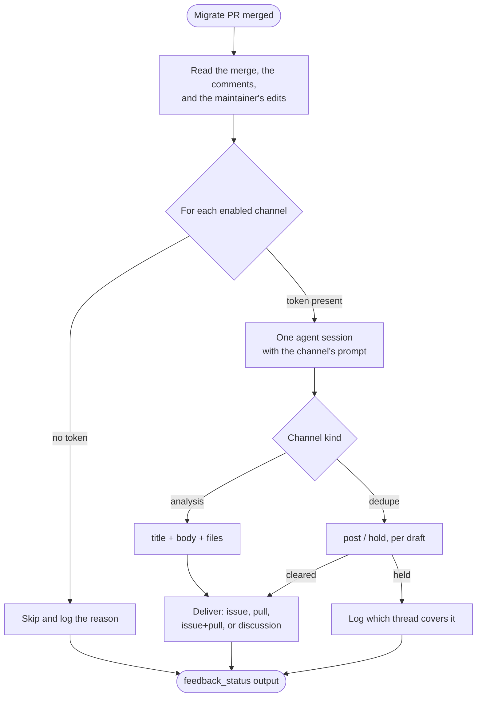

# Installation and configuration

Everything a consumer sets up: the secrets to create, the workflow to copy, every configuration key and its default, and the optional feedback channels that report a merged migration back to the projects it concerns.

## Install

1. Add the repository secret `DEEPSEEK_API_KEY_DSH_MIGRATE_BOT` (or another name, mapped through `api_key_env` / `secrets.apiKeyEnv`).
2. Copy [examples/workflow.yml](../examples/workflow.yml) to `.github/workflows/dsh-migrate.yml` and set the cron.
3. Optionally copy [examples/dsh-migrate.yml](../examples/dsh-migrate.yml) to `.github/dsh-migrate.yml`.

Required workflow permissions: `contents: write`, `issues: write`, `pull-requests: write`. Also enable **Allow GitHub Actions to create and approve pull requests** (Settings → Actions → General → Workflow permissions). Without that checkbox `GITHUB_TOKEN` can push the branch and open the Issue, then gets 403 on `POST /pulls`.

Schedule, `workflow_dispatch`, and `repository_dispatch` belong in that workflow file. GitHub only runs `on.schedule` from a workflow in your repository; the Action cannot register a timer.

The first run always proceeds. Later scheduled runs skip when `dsh-v*` has not changed. Re-run the same version with `force: true` on `workflow_dispatch`.

## Configuration

| Field | Default |
|---|---|
| `dshVersion` | `latest` (the newest `dsh-v*` release) |
| `dsh.provider` | `deepseek-official` |
| `dsh.model` | `deepseek-v4-flash` |
| `dsh.thinking` / `dsh.reasoningEffort` | enabled / `max` |
| `dsh.mode` | `standard` (a dsh agent preset id: `standard`, `minimal`, `cordis`, `ptc`) |
| `review.policy` | `always` (`skip-if-mechanical-pass` skips the A/B reviews when the fast gate passed) |
| `watch.enabled` | `true` |
| `verify.boot` | enabled, 180s watchdog |
| `verify.web` | enabled (runs only when the plugin declares a `dsh.client` surface) |
| `e2e` | enabled, branch `dsh-migrate/e2e`, `forceRebase: true`, gate `advisory` |
| `timeouts` | agent session 60m, each mechanical command 20m, harness checkout 10m |
| `loop.maxAttempts` | 5 (the full budget; an early stop is evidence-driven) |
| `issuePr.language` | `en` |
| `secrets.apiKeyEnv` | `DEEPSEEK_API_KEY_DSH_MIGRATE_BOT` |
| `quota.limit` | unset (caps this run's own official USD estimate) |
| `feedback.enabled` | `true` (the master switch; every channel still needs its own `enabled`) |
| `feedback.channels.*.enabled` | `false` for all three built-in channels |
| `tests.commands` | unset (the built-in suite runs; setting this list **replaces** it) |

Override the review prompts under `prompts.absorption`, `prompts.alignment`, and `prompts.fix` in `.github/dsh-migrate.yml`.

Action inputs: `dsh_version`, `config`, `mechanical_only`, `skip_github`, `force`, `api_key_env`, `workdir`, `quota_limit`, `refresh_only`, `feedback_only`, `pull_request`. To use a different API-key secret, set `api_key_env` (or `secrets.apiKeyEnv`) and map that name in the workflow `env:` block.

Before each agent session the Action queries official remaining balance (`GET /user/balance` for DeepSeek). If the account is unavailable the run stops. `quota.limit` / `quota_limit` caps this run's own official USD estimate (this run's cache-miss / cache-hit / output tokens × [published rates](https://api-docs.deepseek.com/quick_start/pricing), peak/off-peak from each request timestamp). Other model providers have no official balance query or rate table yet.

The verification layers (`verify`, `e2e`) need no API key: the boot probe points the model route at a dead port, and E2E runs against a local `dsh web`. Only the A/B/C agent sessions and the feedback sessions spend tokens.

## Feedback channels

A migrate pull request is an opinion; merging it is the maintainer's verdict. The feedback stage runs **only on a merged migrate pull request** — a closed one proves nothing and is never reported — and forwards what happened to channels you enable.

Each channel runs one agent session over the same evidence and delivers what it wrote:



The evidence is the same for every channel: the plugin, the `from → to` corridor, the merge, every human comment on the issue and pull request, **the files the maintainer changed on the branch before merging**, the run's own A/B/C and patch reports, and — for the discussion channel — the official threads already found.

### The three built-in channels

| Channel | Writes to | Method | Prompt reaches for |
|---|---|---|---|
| `upgrade-skill` | `oh-my-dsh/dsh-plugin-upgrade-skill` | issue (label `bug`) | A wrong or stale version card, or a corridor with no card, in that repository's own bug-report shape. **Enabling it also loads their skills into the migration** — see below |
| `migrate-bot` | `royenheart/dsh-migrate-bot` | issue | What the maintainer had to fix by hand, attributed to the stage that should have caught it |
| `harness-discussion` | `deepseek-ai/deepseek-harness` | discussion (`Ideas`) | Nothing: it classifies the draft the migration already wrote, and posts it unless an equivalent thread has appeared since |

`upgrade-skill` deliberately opens an **issue**, never a pull request. Upstream rules forbid adding version cards as a side effect of migrating somebody else's plugin, and a version-corridor claim is a coordination lock that a machine must not take.

`harness-discussion` deliberately carries **no** draft-writing prompt: the draft is written during the A/B reviews, and posting it is all that is left to do. The model's only job is the one thing the reviews could not know — whether somebody requested the same change, or shipped it, in the meantime.

### Enabling `upgrade-skill` also changes how the migration runs

This is the one channel that is not only an output. Enabling it loads the community upgrade knowledge — the version cards, the corridor index and the seven-class touchpoint checklist from [`oh-my-dsh/dsh-plugin-upgrade-skill`](https://github.com/oh-my-dsh/dsh-plugin-upgrade-skill) — into the A/B/C sessions, so the agent migrates with that knowledge available instead of from the harness source alone. Leaving it off keeps the skill root empty, so a run that did not ask for that knowledge cannot be influenced by it.

The knowledge is vendored into the image at the commit this repository pins for its own benchmark submodule, so a migration and the benchmark score recorded for that mode describe the same snapshot. When the channel is on and the vendored directory is missing, the run logs `skills — unavailable` and migrates without them rather than failing.

### Credentials

Every channel needs a token that may write to **its** repository. The workflow's `GITHUB_TOKEN` is minted for the plugin repository and cannot write to any of these targets, so each enabled channel needs a repository secret with that access:

| Channel | Secret |
|---|---|
| `upgrade-skill` | `DSH_MIGRATE_FEEDBACK_UPGRADE_SKILL_TOKEN` |
| `migrate-bot` | `DSH_MIGRATE_FEEDBACK_BOT_TOKEN` |
| `harness-discussion` | `DSH_MIGRATE_FEEDBACK_HARNESS_TOKEN` |

The name is configurable per channel through `tokenEnv`, and the workflow must map it into the step's `env:` block. A channel that is enabled without its token is **skipped with the reason in the log** — never an error, and never a failed run. The full analysis of which credential can reach a repository the plugin does not own is in [official-discussion-auto-post.md](official-discussion-auto-post.md).

### Enabling a channel

```yaml
feedback:
  channels:
    migrate-bot:
      enabled: true
```

That is the whole configuration for a built-in: `repo`, `method`, `tokenEnv`, `labels`, and `discussionCategory` all come from its shipped default. Every one of them can be overridden.

### A channel of your own

Any key that is not one of the three built-ins is a channel you define. `repo`, `method`, and `prompt` are required, because nothing can default them:

```yaml
feedback:
  channels:
    my-team-log:
      enabled: true
      repo: my-org/migration-log
      method: issue            # issue | pull | issue+pull | discussion
      tokenEnv: MY_MIGRATION_LOG_TOKEN
      labels: [migration]
      prompt: |
        Report this migration to our team log. Say which plugin moved which
        corridor, what the maintainer changed before merging, and what we should
        do differently next time.
```

Your prompt is wrapped in the same contract the built-ins use: the session receives the rendered evidence, and must end with

```json
{ "title": "…", "body": "…", "files": [] }
```

`files` is used only when the method delivers a pull request. A custom `discussion` channel is classified like the built-in one and must end with its `decisions` list instead.

### What this stage never does

- It never reports a pull request that was opened, only one that was **merged**.
- It never fails the run: a missing token, a missing key, a failed session, or an unreachable API is a logged skip or a logged failure on that channel, and the job still succeeds.
- It never posts twice for the same merge: the channel's successful delivery is recorded in the run's step summary and the `feedback_status` output.

## Agent checklist

> **For an agent configuring this Action in someone else's repository:** enabling a feedback channel makes a third-party repository receive a machine-written issue or discussion, so ask before you turn one on. Ask the three questions below separately — they are independent, and "no" is a normal answer to each.
>
> ---
>
> **Question 1 of 3 — `upgrade-skill`.** Do you want migrations to run with the community upgrade knowledge loaded, and a report sent back to it?
>
> Say plainly what this does in both directions: enabling it loads [`oh-my-dsh/dsh-plugin-upgrade-skill`](https://github.com/oh-my-dsh/dsh-plugin-upgrade-skill)'s version cards and corridor index into the migration sessions, **and** opens an issue in that repository describing what the migration found wrong or missing in that knowledge. It needs a token with write access to `oh-my-dsh/dsh-plugin-upgrade-skill`, stored as `DSH_MIGRATE_FEEDBACK_UPGRADE_SKILL_TOKEN`. Off, the migration runs from the harness source alone and nothing is sent.
>
> If they ask what the benefit is, cite the recorded results: [the upstream benchmark section of the README](../README.md#upstream-benchmark) scores this Action's agent on that project's own exam tasks, and reports/ holds the records the table is generated from.
>
> **Question 2 of 3 — `migrate-bot`.** Do you want a report about how the migration bot itself performed, sent to this Action's own repository?
>
> This one is maintenance feedback for the Action's maintainers, not for you: on a merged migrate pull request it opens an issue in `royenheart/dsh-migrate-bot` describing what you had to fix by hand and which gate should have caught it. It needs a token with write access there, stored as `DSH_MIGRATE_FEEDBACK_BOT_TOKEN`.
>
> **Question 3 of 3 — `harness-discussion`.** Do you want the feature request your migration drafted to be posted to the DeepSeek Harness Ideas discussions once you merge the migration?
>
> The draft is written during the reviews either way and is left on the plugin's issue for you to post by hand. Enabling this posts it automatically after you merge the migrate pull request, unless someone already requested or shipped the same thing. It needs a token with write access to `deepseek-ai/deepseek-harness`, stored as `DSH_MIGRATE_FEEDBACK_HARNESS_TOKEN`.
>
> ---
>
> After the three answers:
>
> 1. Name the token each enabled channel needs and say it must have write access to that channel's repository, because the workflow's `GITHUB_TOKEN` cannot reach it. Never ask the user to paste a token into the workflow file.
> 2. Add the `feedback` job from [examples/workflow.yml](../examples/workflow.yml) only when at least one channel is enabled, and map exactly the secrets for the channels in use.
> 3. If the user wants a destination that is not built in, ask for the repository, the delivery method (`issue`, `pull`, `issue+pull`, or `discussion`), the token's secret name, and the wording they want; then write a custom channel as described above.
> 4. Do not enable a channel the user did not ask for, and do not invent a token name the workflow does not map — a channel enabled without its token only produces skip lines.
